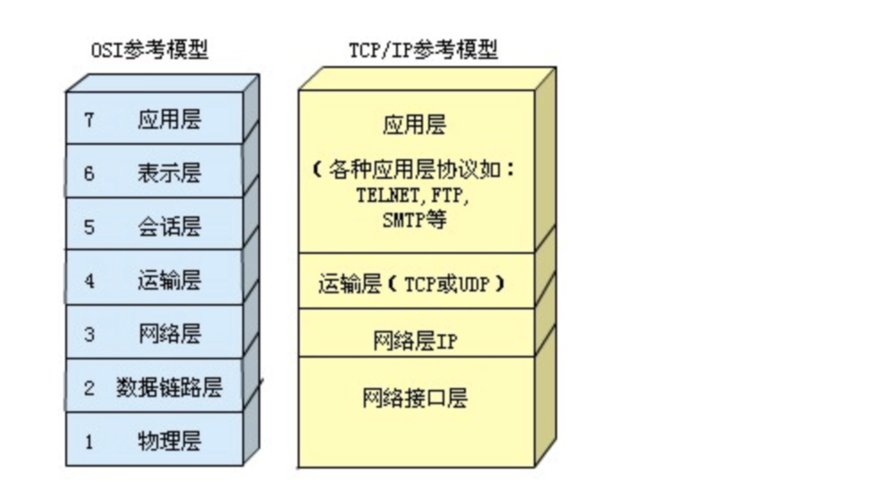

1. get post的区别

   - 发送数据的大小

     请求会将参数在浏览器地址栏中以?key1=value1&key2=value2...的键值对形式明文发送至服务器，相对于POST而言不是很安全而且大小受到限制；POST请求则是在HTTP请求体中附上数据，相对GET请求较为安全，另外请求体大小默认没有限制

   - 编码方式

     GET请求的参数会被浏览器编码为默认格式，当请求参数中含有中文时，POST的请求体则不会受到太大影响。

   - 适用场景

     GET请求主要用于获取信息，一般不会修改服务器资源的状态，对于同一个URL请求的资源来说，结果应该是相等的（幂等）；POST请求用于提交数据，如果不做相应的处理，可能会发生安全问题（如表单数据提交时插入)

     

2. session  和 cookies的区别

   - 存储位置 

     cookie 在客户端（浏览器）session 在服务器端（默认被存在在服务器的一个文件里（不是内存））

     session 的运行依赖 session id，而 session id 是存在 cookie 中的，也就是说，如果浏览器禁用了 cookie ，同时 session 也会失效（但是可以通过其它方式实现，比如在 url 中传递 session_id） 

   - 典型的场景

     session 购物车    cookie   记录用户名 密码  喜好

     

3. http 301和302

   - 官方解释

     301 redirect: 301 代表永久性转移(Permanently Moved)
     302 redirect: 302 代表暂时性转移(Temporarily Moved )

   - 相同点

     301和302状态码都表示重定向，就是说浏览器在拿到服务器返回的这个状态码后会自动跳转到一个新的URL地址

   - 不同点

     301表示旧地址A的资源已经被永久地移除了（这个资源不可访问了），搜索引擎在抓取新内容的同时也将旧的网址交换为重定向之后的网址
     302表示旧地址A的资源还在（仍然可以访问），这个重定向只是临时地从旧地址A跳转到地址B，搜索引擎会抓取新的内容而保存旧的网址，容易被用作网络劫持

   - 参考

     [http 301和302的区别](https://www.cnblogs.com/lanqiu5ge/p/9457074.html)

     

4. http 500 502 504

   - 500 表示服务器内部错误，检查下代码，可能是代码的问题或者是数据库、缓存操作的问题

   - 502 表示网关错误，php-fpm没有启动或者php-fpm处理时间超过了自己限定的最大时间，主动关闭连接

   - 503 表示服务不可用，检查下服务器是否过载，或者服务器主动拒绝访问，访问的资源没有权限

   - 504 表示网关超时，php-fpm长时间不返回结果，导致超过nginx设置的超时时间

   - 参考

     [http 502 和 504 的区别](https://blog.csdn.net/qq_32792365/article/details/85233583)

5. 网络模型和各层数据

   - tcp/ip四层网络模型

     

   - tcp和udp的区别

     

   - 三次握手、四次挥手

     - 三次握手

       第一次握手，发送SYN报文，传达信息：“你好，我想建立连接”；

       第二次握手，回传SYN+ACK报文，传达信息：“好的，可以建立链接”；

       第三次握手，回传ACK报文，传到信息：“好的，我知道了，那我们连接”。然后就建立连接了。

       注意：在发送报文之前各方都要确认可以进行连接。
       之所以采取三次握手机制，不过是为了信息传输的可靠性，如果其中某个握手失败，这个过程将会重复，来确保其可靠性。

     - 四次挥手

       第一次握手，发送FIN报文，传达信息：“结束连接吧”；
       第二次次握手，回传ACK报文，传达信息：“好的 稍等我传完数据”；
       第三次握手，回传FIN报文，传达信息：“传完数据了，结束吧”；
       第四次握手，发送FIN报文，

6. 输入url后的请求过程，以及http报文的请求格式

   [http请求的结构](https://note.youdao.com/s/Cgc3xx19)

