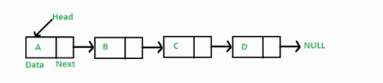

1. 链表是什么

   - 定义

     多个元素组成的列表

     元素存储不连续，用next指针连在一起

     

   - 链表出现原因

     会有在中间新增元素的需求

     链表增删非首尾元素，不需要移动元素，只需要更改next的指向即可。

   - 链表的操作

     ```js
     // 初始化链表
     let a = {value:2};
     let b = {value:3};
     let c = {value:4};
     let d = {value:5};
     a.next = b;
     b.next = c;
     c.next = d
     
     // 遍历链表
     let p = a;
     while (p) {
         console.log(p.value)
         p = p.next
     }
     
     // 插入元素
     const e = {value:6};
     c.next = e;
     e.next = d;
     ```

   - 删除链表中的节点

     - 步骤

       将删除节点的值改为下个节点的值

       删除下一个节点

     - 代码

       ```js
       /**
        * Definition for singly-linked list.
        * function ListNode(val) {
        *     this.val = val;
        *     this.next = null;
        * }
        */
       /**
        * @param {ListNode} node
        * @return {void} Do not return anything, modify node in-place instead.
        */
       var deleteNode = function(node) {
           node.val = node.next.val;
           node.next = node.next.next;
       };
       ```

   - 反转链表 206

     - 思路

       假设只反转两个节点，那么只需要将n+1的next指向n就可以

       反转多个的话，就需要双指针遍历链表，重复上述操作
     
     - 代码
     
       ```js
       /**
        * Definition for singly-linked list.
        * function ListNode(val, next) {
        *     this.val = (val===undefined ? 0 : val)
        *     this.next = (next===undefined ? null : next)
        * }
        */
       /**
        * @param {ListNode} head
        * @return {ListNode}
        */
       var reverseList = function(head) {
         	// 双指针遍历链表
           let p1 = head;
           let p2 = null;
           while(p1) {
               // console.log(p1.val, p2 && p2.val);
               const tmp = p1.next;
               p1.next = p2; // 将p1的next指针指向p2
               p2 = p1;
               p1 = tmp;
           }
       
           return p2;
       };
       ```
     
   - 两数相加

     - 思路

       模拟相加的操作，遍历链表

        新建一个链表

        遍历被相加的两个链表，模拟相加操作，将个位数追加到新的链表上，

       将十位数留到下一位去相加

     - 代码实现

       ```js
       /**
        * Definition for singly-linked list.
        * function ListNode(val, next) {
        *     this.val = (val===undefined ? 0 : val)
        *     this.next = (next===undefined ? null : next)
        * }
        */
       /**
        * @param {ListNode} l1
        * @param {ListNode} l2
        * @return {ListNode}
        */
       var addTwoNumbers = function(l1, l2) {
           const l3 = new ListNode(0); //创建一个新的链表
           let p1 = l1;
           let p2 = l2;
           let p3 = l3;  // 用来构造新的链表
           let carry = 0;
       
           while(p1 || p2) {
               const v1 = p1 ? p1.val : 0;
               const v2 = p2 ? p2.val : 0;
               const value = v1 + v2 +carry;
               carry = Math.floor(value/10);
               p3.next = new ListNode(value % 10);
               if(p1) p1 = p1.next;
               if(p2) p2 = p2.next;
               p3 = p3.next;
           }
           if(carry) {
               p3.next = new ListNode(carry);
           }
       
           return l3.next;
       };
       ```

       

